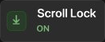

# Lock Keys Notifier

A [Windhawk](https://github.com/ramensoftware/windhawk) mod that displays a
small, customizable toast notification whenever a lock key — **Caps Lock**,
**Num Lock**, **Scroll Lock**, or **Insert** — is toggled, showing its new
**ON/OFF** state.

## Preview

The three layouts, following the system theme and accent:

| Pill | Tile | Minimal |
|:---:|:---:|:---:|
|  |  |  |

Insert can show a single fixed label in a neutral color instead of ON/OFF:

## Features

- Toast on lock-key toggle, showing the resulting ON/OFF state.
- Per-key enable/disable (ignore the keys you don't care about).
- 9-point positioning with X/Y offsets, on the active, primary, or all monitors.
- Fully themeable: background/text/border colors, opacity, corner radius,
  padding, font family/size/weight/italic, a configurable drop shadow
  (toggle/size/opacity/offset/color), and an optional per-key accent state pill.
- Follows the system light/dark theme and accent color by default; any color is
  overridable with a hex value.
- Optional fade animation and optional sound (system default or a custom WAV).
- Three layouts (Pill, Tile, Minimal); optional per-key icon glyph; editable
  ON/OFF labels and key names.
- Insert can optionally show a single fixed label (e.g. "pressed") in neutral
  color instead of ON/OFF.
- Per-monitor DPI aware: sizes are scaled to each monitor, so the toast looks the
  same physical size on mixed-DPI setups.

## How it works

This is a Windhawk [tool mod](https://github.com/ramensoftware/windhawk/wiki/Mods-as-tools:-Running-mods-in-a-dedicated-process):
it runs in its own dedicated `windhawk.exe` process rather than being injected
into `explorer.exe`. It installs a global low-level keyboard hook on a dedicated
thread; on each lock-key release it reads the key's live toggle state and draws a
click-through layered window. The window never steals focus and ignores mouse
input.

## Settings

All options are configured from the Windhawk settings UI. Highlights:

| Setting | Default | Notes |
|---|---|---|
| Notify on Caps/Num/Scroll/Insert | on/on/on/off | Per-key toggles |
| Don't show when a fullscreen app is active | off | Skips the toast for fullscreen games (DirectX or borderless), fullscreen video, and presentation mode. Focus Assist is not affected |
| Display duration (ms) | 1500 | Time fully visible before fade-out |
| Target monitor | Active | Active / Primary / All |
| Position + offsets | Bottom center, 0 / 48 | 9-point anchor + px offsets |
| Colors | blank (theme) | Hex; blank follows system theme/accent |
| Font | Segoe UI, 24px, Semibold | Family, size, weight (Thin–Black), italic |
| Layout | `Pill` | Pill / Tile / Minimal; ON uses the system accent, OFF neutral |
| Sound | None | None / System default / Custom WAV |

## Notes & caveats

- The mod runs in its own `windhawk.exe` process, so notifications keep working
  even when Explorer is restarting or not running.
- **Toggles made while an app running as administrator (elevated) has keyboard
  focus are not detected.** The mod process runs at medium integrity, and Windows
  (User Interface Privilege Isolation) blocks a medium-integrity process from
  observing input directed at a higher-integrity window — this affects every
  input method (hooks, raw input, `GetKeyState`), so it can't be worked around
  from a mod. The next toggle made in a normal app is detected with the correct
  state. (Standalone tools like FluentFlyout share this exact limitation.)
- Fullscreen exclusive applications (some games) may cover the topmost toast.
- **Insert** reports the OS toggle bit, not any application's overtype mode,
  which is application-specific. It is off by default.
- Runs in the 32-bit `windhawk.exe` tool-mod host (builds for both x86 and x86-64).

## License

[MIT](LICENSE) © 2026 Havrlisan
